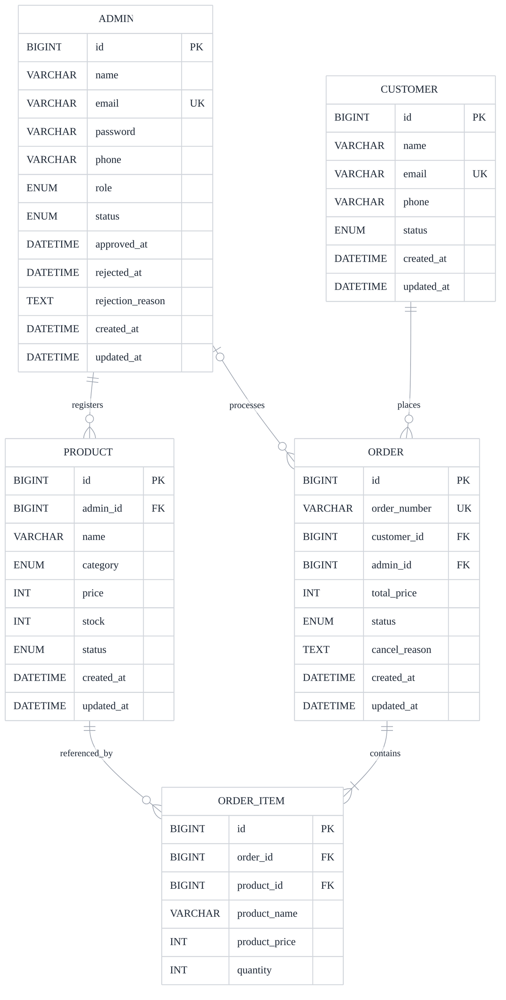

# Ecommerce Backoffice ERD

아래 ERD는 현재 엔티티 구조를 기준으로 정리한 심플 버전입니다.

## 관계 요약

- `Admin` 1명은 여러 `Product`를 등록할 수 있습니다.
- `Customer` 1명은 여러 `Order`를 가질 수 있습니다.
- `Order` 1건은 여러 `OrderItem`을 포함합니다.
- `Product` 1개는 여러 `OrderItem`에서 참조될 수 있습니다.
- `Order.admin_id`는 주문 처리 담당 관리자를 의미하며 nullable 입니다.
